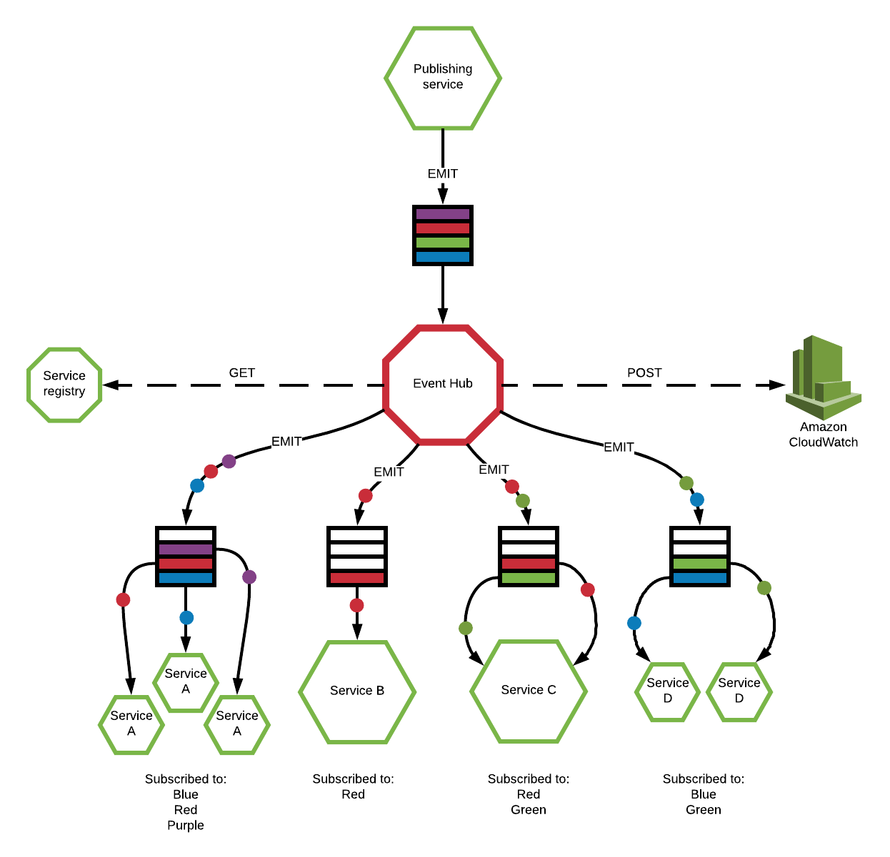
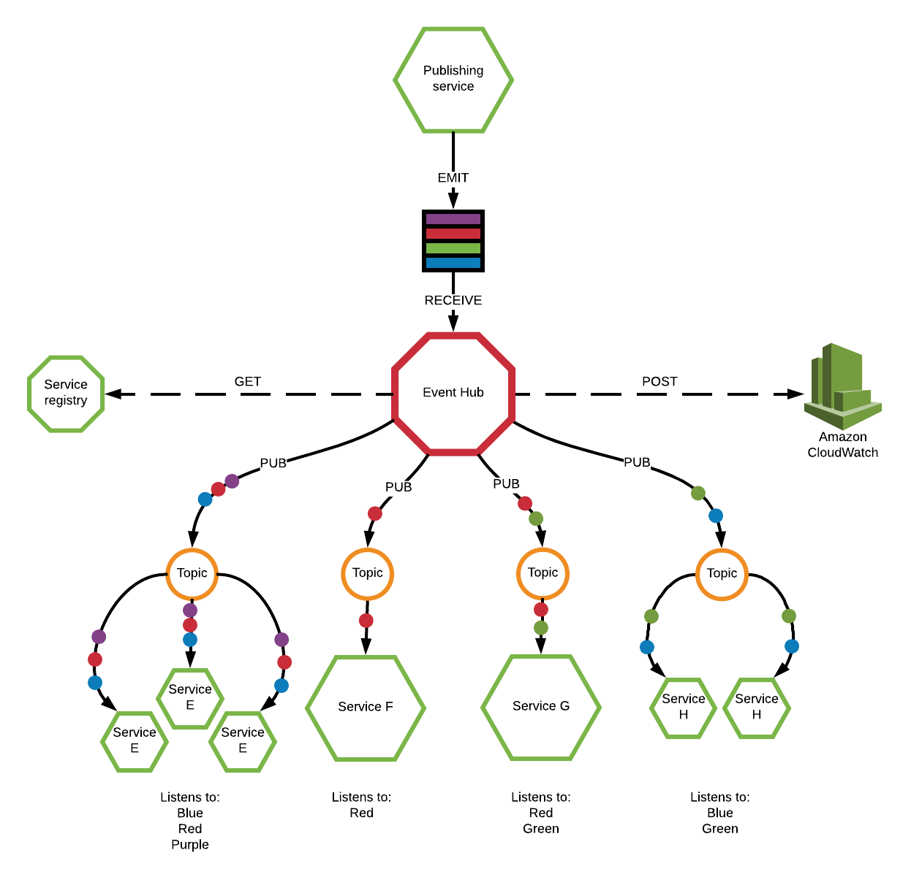

# Microservices - Event Hub
## :triangular_ruler: Architecture
Events within the Sonder ecosystem need to be distributed to its microservices, however, there is a certain amount of routing logic required. It is the individual microservices which decide this logic by defining at registration which events it wants to receive, either by all instances of the microservices or just by one.

The event hub can use Amazon MQ (ActiveMQ) or Azure Service Bus as a message broker.

### Single instance reaction (Queuing)
Some events will cause one time reactions, e.g. a member entering a geofenced area will require a notification to be sent. These events should only to be sent to a single instance of a microservice so that it can initiate the logic to send the notification just once. 

For this scenario the Event Hub will distibute an event to a queue for that microservice which will be picked up by a single instance.



### Multiple intstance reaction (Pub/Sub)
Other events will cause all instances of a microservice to perform an actions, e.g. a user entering a geofenced area will need to update all instances of an in-memory view of current users locations to keep them all current.

For this scenario the Event Hub will send an event to a topic which all instances of a microservice are listening to, allowing them all to react.



To abstract complexity from the microservices, the Event Hub uses the same Service Registry as the Service Mesh, this means that a microservice just needs to register itself once to be given both a queue and topic for itself. During this registration the microservice will declare which events it wants to be sent to a queue and which events it would like to be sent to a topic, this list is stored by the Service Registry and used by the Event Hub to know which events to forward through which mechanisms

With this pattern, individual microservices can be scaled to multiple instances and messages will only be receieved in the way the microservice requires. For queued messages it is imperative for microservices to use acknowledgements to notify the message broker that the event has been recieved and processed. This pattern also allows for all instances of a microservice to go offline and events to persist and be processed when they come back online.

## :mailbox_with_mail: Receiving

All services send their event messages to a single queue called `event-hub` where they will be picked up by the event-hub, these events must have an explicit structure outlined below.

## :white_check_mark: Validating

```json
{
    "request_id": "guid",
    "source": "string",
    "name": "string",
    "timestamp": "date",
    "payload": { 
        "some": "json"
    }
}
```

* ***request_id*** - the request ID passed through from the service mesh
* ***source*** - the name of the service which produced the event
* ***name*** - the name of the event in noun:verb format where the verb is in the past tense e.g. `geofence:created`
* ***timestamp*** - the time when the service created the event to track how fast it is processed
* ***payload*** - any json payload

## :recycle: Transforming

The Event Hub will validate this structure before adding two new properties:
* ***id*** - a unique id for the event
* ***processed_timestamp*** - the time when the event was processed by the Event hub

## :loudspeaker: Publishing

The Event Hub will then send that event to a queue or a topic for each microservice within the ecosystem if that microservice subscribed to that event when it registered itself. The list of services is persisted in memory and is retrieved from the Service Registry every *n* seconds via an http request. This in memory registry helps to keep the speed of processing fast and the load on the Service Registry low.

## :pencil: Logging

The Event Hub will also send all events and their destinations, including those which did not pass validation, to Elasticserch or Application Insights so they can be monitored and alerted upon.

## :chart_with_upwards_trend: Scale
The Event Hub is stateless and thus can be scaled horizontally to hundreds of instances to handle any influx of load from the original queue.